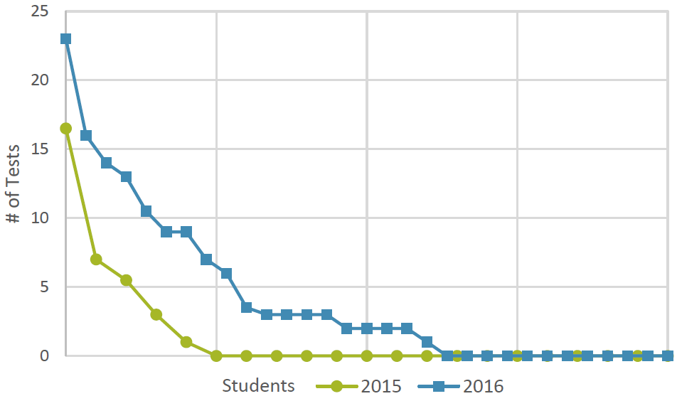

# Prof. CI
## Employing Continuous Integration Services and Github Workflows to Teach Test-driven Development

Teaching programming using Massive Open Online Courses (MOOCs) is gaining popularity due to their scalability and efficiency of knowledge distribution. However, participating in these courses usually means fully committing to the supplied programming environment in the browser. While this allows a consistent and controllable setup, learners do not gain experience with actual development tools, such as local code editors, testing frameworks, issue trackers or continuous integration (CI) services, which is critical for subsequent real-world projects. Furthermore, the tests for the functionality that is to be developed are oftentimes already available in MOOCs and simply need to be executed, leading to less involvement with developing appropriate tests.

In order to tackle these issues while maintaining a high degree of automation and scalability, we developed Prof. CI, a novel approach to online exercises. Prof. CI leverages the existing automation infrastructure that developers use daily, i.e. CI services and Github workflows, to teach test-driven development (TDD) practices. Participants work on their own repositories in Github and receive feedback and new challenges from the CI server when they push their code. We have successfully applied this approach in a pilot project with 30 undergraduate students learning the Ruby on Rails web development framework. Our evaluation shows that the exercise effectively increased students' motivation to write tests for their code. We also present the results of participant surveys, students' experiences and teachers' observations.

 
<em>Number of tests written by each student, after working on a software project  for two weeks. 
In 2015, students were prepared with MOOCs and an example  project, in 2016 with a Prof. CI exercise.
No only did the average number of  tests written increase, but also more students considered tests in their work.</em>

The work was presented at the [Frontiers in Education 2017](http://fie2017.org/) conference.

## Links

 * [Preprint of Prof. CI publication](prof_ci.pdf)
 * [Repository containing the Prof. CI exercise](https://github.com/hpi-epic/profci-exercise#prof-ci----ruby-on-rails-and-tdd-exercise)
 * [Hidden requirement tests](https://github.com/hpi-epic/profci-tasks/tree/master/spec/_tdd_tasks)
 * [Work results after regular introduction exercise](https://github.com/hpi-epic/wimi-portal-analysis/wiki)
 * [Work results after Prof. CI introduction exercise](https://github.com/hpi-epic/workshop-portal-analysis/wiki)
